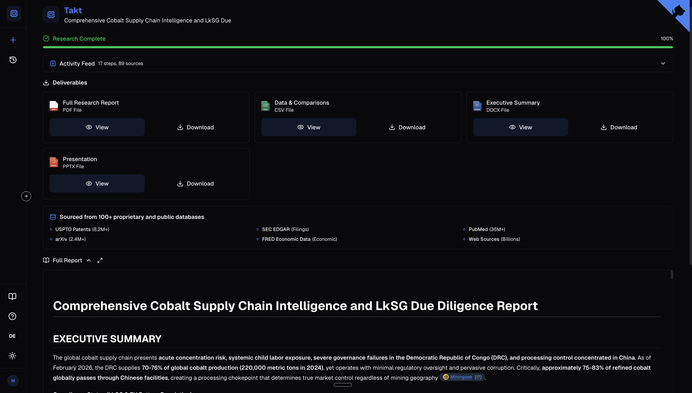

# [Takt](https://takt.valyu.ai)

AI-powered deep research that generates board-ready reports with professional deliverables from 100+ proprietary and public data sources - in minutes, not weeks.

Built on the [Valyu DeepResearch API](https://docs.valyu.ai/guides/deepresearch-quickstart).

**[Try the live demo](https://takt.valyu.ai)**



## How it works

```
                                    ┌─────────────────────┐
                                    │   Describe your      │
                                    │   research topic      │
                                    └──────────┬──────────┘
                                               │
                                               ▼
                          ┌────────────────────────────────────────┐
                          │         Valyu DeepResearch API          │
                          │                                        │
                          │  Searches 100+ sources in parallel:    │
                          │  Patents, SEC filings, PubMed, arXiv,  │
                          │  clinical trials, economic data, web   │
                          └──────────────────┬─────────────────────┘
                                             │
                      ┌──────────┬───────────┼───────────┬──────────┐
                      ▼          ▼           ▼           ▼          ▼
                   ┌──────┐  ┌──────┐  ┌──────────┐  ┌──────┐  ┌──────┐
                   │ PDF  │  │ DOCX │  │   PPTX   │  │ CSV  │  │Report│
                   │Report│  │Exec  │  │   Deck   │  │ Data │  │ URL  │
                   │      │  │Brief │  │          │  │      │  │      │
                   └──────┘  └──────┘  └──────────┘  └──────┘  └──────┘
```

## Research modes

| Mode | What you get |
|---|---|
| **Supplier Due Diligence** | Financial health, ESG scoring, LkSG compliance, geographic risk, alternative sourcing |
| **Patent Landscape** | Technology clustering, prior art, white space analysis, IP benchmarking across USPTO, EPO, WIPO, CNIPA, JPO |
| **Regulatory Intelligence** | EU/US/China regulation tracking, compliance timelines, OEM and supplier impact assessments |
| **Competitive Analysis** | Market positioning, SWOT analysis, technology comparison, M&A landscape |
| **Custom Research** | Open-ended - bring your own prompt |

## Data sources

```
┌─────────────────────────────────────────────────────────────────────┐
│                        100+ Data Sources                            │
├──────────────────┬──────────────────┬───────────────────────────────┤
│  Patents         │  Financial       │  Academic                     │
│  ├ USPTO (8.2M+) │  ├ SEC EDGAR    │  ├ PubMed (36M+)             │
│  ├ EPO           │  ├ FRED         │  ├ arXiv (2.4M+)             │
│  ├ WIPO          │  ├ BLS          │  ├ bioRxiv                    │
│  ├ CNIPA         │  └ World Bank   │  └ medRxiv                    │
│  └ JPO           │                  │                               │
├──────────────────┼──────────────────┼───────────────────────────────┤
│  Clinical        │  Chemical        │  General                      │
│  ├ ClinicalTrials│  ├ ChEMBL (2.4M+)│  └ Web (billions of pages)  │
│  └ FDA labels    │  └ DrugBank     │                               │
└──────────────────┴──────────────────┴───────────────────────────────┘
```

## Quick start

```bash
git clone https://github.com/yorkeccak/takt.git
cd takt
pnpm install
cp .env.example .env.local
```

Add your Valyu API key to `.env.local` (get one at [valyu.ai](https://valyu.ai)):

```env
VALYU_API_KEY=your_valyu_api_key_here
```

```bash
pnpm dev
```

Open [http://localhost:3000](http://localhost:3000).

## Stack

[Next.js 15](https://nextjs.org) / [React 19](https://react.dev) / [Tailwind CSS 4](https://tailwindcss.com) / [Valyu DeepResearch API](https://docs.valyu.ai) / [Zustand](https://zustand.docs.pmnd.rs) / TypeScript

## License

MIT

## Links

- [Valyu](https://valyu.ai) - AI search API
- [API documentation](https://docs.valyu.ai/guides/deepresearch-quickstart)
- [Valyu JS SDK](https://www.npmjs.com/package/valyu-js)
